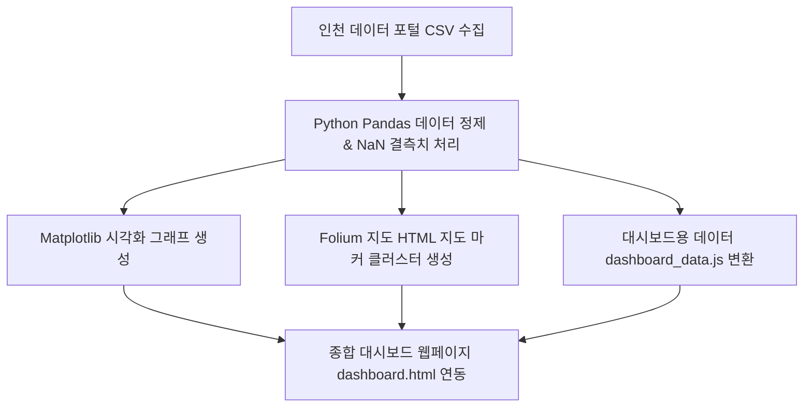

# 📚 인천광역시 도서관 분포 및 장서수 분석 대시보드 프로젝트

본 프로젝트는 **인천 데이터 포털**의 공공데이터를 기반으로 인천 내 공공도서관의 인프라와 장서 현황을 분석하고, 사용자의 목적에 따른 맞춤형 도서관 방문을 지원하기 위해 개발되었습니다. 

Python(Pandas, Matplotlib, Folium)을 활용한 데이터 가공 및 시각화 프로세스와 웹 표준 기술(HTML, CSS, JavaScript) 기반의 반응형 대시보드를 결합하여 데이터의 접근성과 활용성을 극대화했습니다.

---

## 🎯 프로젝트 목적 및 필요성

1. **상황별 맞춤형 도서관 탐색**:
   * **자료 중심 방문**: 전문 서적이나 다량의 참고 자료가 필요한 학술·연구 목적의 사용자를 위해 **도서 보유량이 많은 도서관**을 쉽게 식별할 수 있도록 돕습니다.
   * **거리·편의 중심 방문**: 단순 독서나 자습을 위해 **집 주변의 가까운 도서관**을 찾거나 **열람석이 넉넉한 도서관**을 빠르게 탐색할 수 있도록 돕습니다.
2. **공공데이터의 시각적 재구성**:
   * 텍스트와 수치로만 채워진 행정용 CSV 데이터를 직관적인 그래프와 지도로 시각화하여 정보의 장벽을 낮추고 시민들의 도서관 접근성을 개선합니다.

---

## 🛠️ 기술 스택 및 데이터 처리 흐름

* **Language**: Python (데이터 분석 및 시각화), JavaScript (대시보드 동적 기능)
* **Libraries**:
  * **Python**: `pandas` (데이터 정제), `matplotlib` (정적 그래프 생성), `folium` (지리 정보 지도 시각화)
  * **Web**: Vanilla HTML5, Vanilla CSS3 (HSL 컬러 테마, 반응형 레이아웃), Vanilla JS (정렬, 실시간 검색/필터링)



---

## ✨ 핵심 기능 및 시각화 분석 내용

### 1. Python 데이터 시각화 (charts & maps)
* **구/군별 도서관 분포 비율 (Pie Chart)**:
  * 인천 내 시군구별 도서관 비율을 파스텔톤 원형 차트로 시각화하여, 지역별 도서관 인프라 편차와 분포 수준을 직관적으로 비교할 수 있습니다.
* **도서 보유량 상위 10개 도서관 (Horizontal Bar Chart)**:
  * 많은 도서 자료가 필요한 학술·연구용 방문자들을 위해 보유 도서수가 가장 많은 대형 도서관 Top 10을 수평 막대 차트로 보여줍니다 (예: 미추홀도서관, 연수도서관 등).
* **열람좌석수 대비 도서 보유량 관계 (Scatter Plot)**:
  * 도서 보유량과 열람석 수의 비례 관계를 산점도로 분석합니다. 일정 규모 이상의 대형 도서관은 라벨이 붙어 자습 공간과 자료 확보에 최적화된 곳을 한눈에 식별할 수 있습니다.
* **마커 클러스터링 기반 위치 지도 (Folium Map)**:
  * 인천 중심부를 기점으로 모든 도서관 위치에 마커를 배치합니다. 줌 아웃 시에는 마커 클러스터로 그룹화되어 지역별 밀집도를 보여주며, 마커 클릭 시 해당 도서관의 **유형, 도로명주소, 전화번호, 열람좌석수, 도서보유량** 정보를 팝업창으로 바로 제공합니다.

### 2. 사용자 중심 반응형 웹 대시보드
* **실시간 다중 필터 & 검색 기능**:
  * 검색창에 단어를 타이핑하면 **도서관명, 도로명주소, 전화번호**를 실시간으로 탐색합니다. (데이터 내 `NaN` 결측치로 인한 자바스크립트 오작동을 안전하게 방어하는 예외 처리 반영)
  * 시군구 드롭다운 필터와 도서관유형 드롭다운 필터를 검색과 동시에 적용하여 조건에 맞는 결과를 빠르게 골라냅니다.
* **정렬 가능한 인터랙티브 테이블**:
  * 테이블 헤더(도서관명, 시군구, 유형, 열람좌석수, 도서보유량)를 클릭하면 가나다 오름차순/내림차순 정렬 및 수치 크기순 정렬이 유연하게 토글됩니다. (한글 자모음 정렬은 JavaScript의 `localeCompare` 메소드를 활용해 구현)
* **유리모피즘(Glassmorphic) UI & 다크 모드**:
  * 모던한 HSL 기반의 다크 모드/라이트 모드 토글을 지원하여 야간 가독성을 극대화하고 사용자의 눈 피로를 줄입니다.
  * 그래프 이미지 영역 클릭 시 상세 확대할 수 있는 이미지 모달(Lightbox)을 제공하며, 모달 활성화 시 뒷배경 문서가 스크롤되지 않도록 바디 오버플로우 차단(`overflow: hidden`) 로직이 내장되어 있습니다.

---

## 📁 프로젝트 구조

프로젝트는 코드의 효율적인 공부와 상용 배포 관리를 위해 **주석 버전**과 **비주석 버전**으로 분리 관리됩니다.

```
incheon_library_graph/
  ├── charts/                  # Matplotlib으로 저장된 분석 그래프 이미지 저장소
  ├── maps/                    # Folium으로 동적 생성된 지도 HTML 파일 저장소
  ├── data/                    # 원본 CSV 데이터 및 가공 완료된 JS 데이터셋 저장소
  ├── with_comments/           # 주석 버전 (구현 기술 이해와 실습용)
  │     ├── generate_dashboard_data.py
  │     ├── visualize_libraries.py
  │     ├── dashboard.html
  │     └── dashboard.css
  ├── without_comments/        # 비주석 버전 (최적화 및 클린 코드 배포용)
  │     ├── generate_dashboard_data.py
  │     ├── visualize_libraries.py
  │     ├── dashboard.html
  │     └── dashboard.css
  └── README.md                # 프로젝트 소개 및 실행 가이드 문서
```

---

## 🚀 실행 가이드

### 1. 데이터 분석 및 시각화 산출물 재생성
가상환경(`venv`)이 활성화된 상태에서 Python 스크립트를 실행하여 데이터 파일과 시각화 차트를 자동 업데이트할 수 있습니다.
```bash
# 데이터 및 통계 파일(dashboard_data.js) 생성
python with_comments/generate_dashboard_data.py

# 시각화 그래프 이미지 및 HTML 지도 생성
python with_comments/visualize_libraries.py
```

### 2. 대시보드 확인
* 생성 완료 후 `with_comments/dashboard.html` 또는 `without_comments/dashboard.html` 파일을 브라우저로 더블 클릭하여 실행하면 인터랙티브 대시보드를 바로 이용할 수 있습니다.
